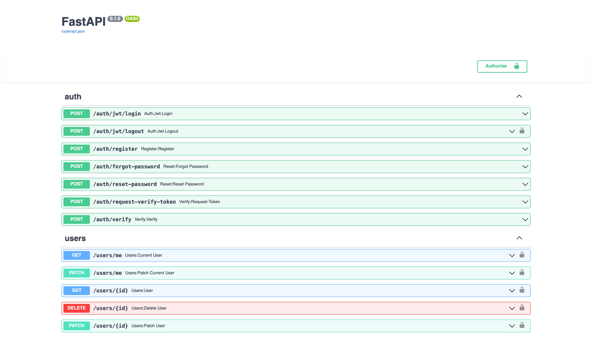

# Walk in Clinic

Implementation of a backend for a Walk In Clinic, part of the PROG8420 Programming for Big Data python course @ Conestoga college.

## Live version

As of this writing, this project is live and deployed in the following URL.

* Frontend: https://wic-frontend.anvil.app/
* Backend: https://wic-backend.herokuapp.com/docs

## Run the project

The project is comprised of two parts, this main repo is the backend server, and the `prog8420-wic-frontend` folder contains all the frontend code built with [Anvil](https://anvil.works/).

### Running the backend
Run the following commands to run the project. 

> You can use [virtualenvwrapper](https://virtualenvwrapper.readthedocs.io/en/latest/) to create the virtual environment, or your desired environment manager.

```shell
# (Optional) create a virtual environment
mkvirtualenv walk-in-clinic
workon walk-in-clinic

# Install dependencies
pip install -r requirements.tx

# Runs the actual web server
uvicorn main:app --reload
```

The above will launch the server in the [http://localhost:8000](http://localhost:8000) address, you can access the swagger documentation by going to the [/docs](http://localhost:8000/docs) path.



### Running the frontend

Change directories to the `prog8420-wic-frontend` folder and run the following commands.

```shell
cd prog8420-wic-frontend

# (Optional) Create an env (virtualenvwrapper)
mkvirtualenv walk-in-clinic
workon walk-in-clinic

# (Optional) Install postgres, search docs for your specific operating system

# Install the Anvil app server
pip install anvil-app-server

anvil-app-server

```

The above will launch the frontend and make it accessible in [http://localhost:3030](http://localhost:3030).

## Accessing the project

The default users are populated once the server is started, and you can see temporary credentials in the logs of the application. 

The default logins for the admin, a staff, and a doctor are:

* admin
* Username: `derbuchanan@example.net`
* Password: `admin`

* staff
* Username: `allduran@gmail.com`
* Password: `u^3Xm@opC_`

* doctor
* Username: `chrfloyd@gmail.com`
* Password: `*a)BANYr*2`

## Troubleshooting

### Failed to start built-in Postgres database:
This may happen in any operating system, below are instructions for the known ones.

#### macOS

Copy the postgres binaries from your installation, to the folders indicated below. This will allow Anvil to run the integrated postgresdb with binaries compiled for your platform.

```shell
cp $(which postgres) .anvil-data/db-bin/PG-2c0c4f55a015ab253337e3d05ca5fd21/bin
cp $(which initdb) .anvil-data/db-bin/PG-2c0c4f55a015ab253337e3d05ca5fd21/bin
cp $(which pg_ctl) .anvil-data/db-bin/PG-2c0c4f55a015ab253337e3d05ca5fd21/bin
```

Postgres can be installed as a service in macOS with brew.

```shell
brew install postgresql

# Start it with the systme
brew services start postgresql
```

#### Windows

A common error could appear when trying to install the `anvil-app-server` dependency related to the following message:

> ERROR: Command errored out with exit status 1: python setup.py egg_info Check the logs for full command output

Follow the instructions in [this article](https://exerror.com/error-command-errored-out-with-exit-status-1-python-setup-py-egg_info-check-the-logs-for-full-command-output/) to know how to proceed.

## Contributors

-  Melika Jahanbani ([mell122](https://github.com/mell122))
-  Marcus Diemand ([mjdi](https://github.com/mjdi))
-  Eduardo Gutierrez Silva ([LaloLoop](https://github.com/LaloLoop))
